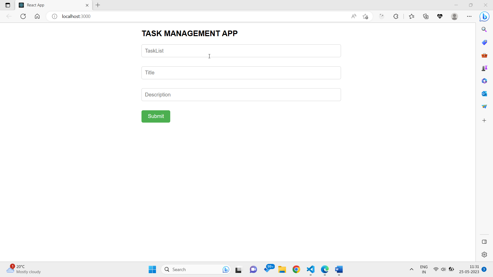

Deployed link: https://646f2062423fed1edcf7ecc5--lucky-sunburst-e981fc.netlify.app/

Functionalities asked: -
1.	Add a task card to the list
2.	Update/ Delete task
3.	Move card to another list
4.	Export the entire list to excel

Introduction
When you open this app, you will be directly navigated to the task management page where, you will find three input fields Task List, Title & Description and a submit button.
1.	To Add a task card to the list
•	Enter the task list name in the “TaskList” field, task title in the “Title” and description in the “Description” respectively and then click the submit button.
•	On submit, a new card will be created below with the list name given by the user.
•	To add new card to the same list, repeat the above steps and you will find one more card the same list name.
2.	To Update or Delete a task 
•	To Update you can click on the edit button, will navigate you to the same input field with that card details, you want to update. Here, you can change all the three inputs TaskList, Title & Description.
•	To Delete a task, click on the “Delete” button, that task will be deleted.
3.	Move card to another list
To move card to another list you have two options here: -
i)	Using “Edit” button: It will navigate you to the same input field with that card details, you want to update. Then change the TaskList field with new task list name.
ii)	Using “ChangeTaskList” button: On click, a prompt will be open & ask you to enter the new task list name. Once you submit the new task list name. It will remove the task from the previous task list and show it into the new task list.
4.	Export the entire list to excel
To export the list to excel click on “Export to excel” button. Once, you click on the button, it will export the whole list to the excel file.

# Getting Started with Create React App

This project was bootstrapped with [Create React App](https://github.com/facebook/create-react-app).

## Available Scripts

In the project directory, you can run:

### `npm start`

Runs the app in the development mode.\
Open [http://localhost:3000](http://localhost:3000) to view it in your browser.

The page will reload when you make changes.\
You may also see any lint errors in the console.

### `npm test`

Launches the test runner in the interactive watch mode.\
See the section about [running tests](https://facebook.github.io/create-react-app/docs/running-tests) for more information.

### `npm run build`

Builds the app for production to the `build` folder.\
It correctly bundles React in production mode and optimizes the build for the best performance.

The build is minified and the filenames include the hashes.\
Your app is ready to be deployed!

See the section about [deployment](https://facebook.github.io/create-react-app/docs/deployment) for more information.

### `npm run eject`

**Note: this is a one-way operation. Once you `eject`, you can't go back!**

If you aren't satisfied with the build tool and configuration choices, you can `eject` at any time. This command will remove the single build dependency from your project.

Instead, it will copy all the configuration files and the transitive dependencies (webpack, Babel, ESLint, etc) right into your project so you have full control over them. All of the commands except `eject` will still work, but they will point to the copied scripts so you can tweak them. At this point you're on your own.

You don't have to ever use `eject`. The curated feature set is suitable for small and middle deployments, and you shouldn't feel obligated to use this feature. However we understand that this tool wouldn't be useful if you couldn't customize it when you are ready for it.

## Learn More

You can learn more in the [Create React App documentation](https://facebook.github.io/create-react-app/docs/getting-started).

To learn React, check out the [React documentation](https://reactjs.org/).

### Code Splitting

This section has moved here: [https://facebook.github.io/create-react-app/docs/code-splitting](https://facebook.github.io/create-react-app/docs/code-splitting)

### Analyzing the Bundle Size

This section has moved here: [https://facebook.github.io/create-react-app/docs/analyzing-the-bundle-size](https://facebook.github.io/create-react-app/docs/analyzing-the-bundle-size)

### Making a Progressive Web App

This section has moved here: [https://facebook.github.io/create-react-app/docs/making-a-progressive-web-app](https://facebook.github.io/create-react-app/docs/making-a-progressive-web-app)

### Advanced Configuration

This section has moved here: [https://facebook.github.io/create-react-app/docs/advanced-configuration](https://facebook.github.io/create-react-app/docs/advanced-configuration)

### Deployment

This section has moved here: [https://facebook.github.io/create-react-app/docs/deployment](https://facebook.github.io/create-react-app/docs/deployment)

### `npm run build` fails to minify

This section has moved here: [https://facebook.github.io/create-react-app/docs/troubleshooting#npm-run-build-fails-to-minify](https://facebook.github.io/create-react-app/docs/troubleshooting#npm-run-build-fails-to-minify)
